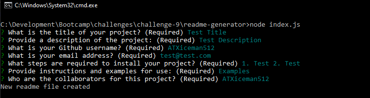
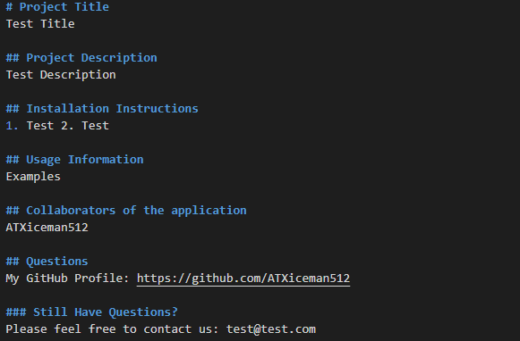

# Readme Generator

## Description

In order to save development time, this application will create everything that a high-quality, professional README should contain. The application works by utilizing the 'fs' and 'inquirer' modules by asking the user via Command Line what information they would like in their readme file. The motivation behind this project was to solve the frustration and the time it takes to create a well-formatted readme file.

### Link to repository:

https://github.com/ATXiceman512/readme-generator

## Table of Contents

- [Installation](#installation)
- [Usage](#usage)
- [Credits](#credits)
- [License](#license)
- [Contributing](#Contributing)

## Installation

Please clone or download the source files for this project. Open your command line application and run 'npm install' in the root directory of the project file. Once the dependencies have finished downloading, please run 'node index.js' from the root directly and it should prompt the user to start entering information.

## Usage

Command Line Interface for the user

Upon successful completion of the form, the readme file will be generated, example below:

Example Video:
https://drive.google.com/file/d/1-nGLHzAv5LiJg1v0f928H3Wku3pMSgSt/view

## Credits

ATXiceman512 - Github profile: https://github.com/ATXiceman512

## License

MIT License

Copyright (c) [2021] [ATXiceman512]

Permission is hereby granted, free of charge, to any person obtaining a copy
of this software and associated documentation files (the "Software"), to deal
in the Software without restriction, including without limitation the rights
to use, copy, modify, merge, publish, distribute, sublicense, and/or sell
copies of the Software, and to permit persons to whom the Software is
furnished to do so, subject to the following conditions:

The above copyright notice and this permission notice shall be included in all
copies or substantial portions of the Software.

THE SOFTWARE IS PROVIDED "AS IS", WITHOUT WARRANTY OF ANY KIND, EXPRESS OR
IMPLIED, INCLUDING BUT NOT LIMITED TO THE WARRANTIES OF MERCHANTABILITY,
FITNESS FOR A PARTICULAR PURPOSE AND NONINFRINGEMENT. IN NO EVENT SHALL THE
AUTHORS OR COPYRIGHT HOLDERS BE LIABLE FOR ANY CLAIM, DAMAGES OR OTHER
LIABILITY, WHETHER IN AN ACTION OF CONTRACT, TORT OR OTHERWISE, ARISING FROM,
OUT OF OR IN CONNECTION WITH THE SOFTWARE OR THE USE OR OTHER DEALINGS IN THE
SOFTWARE.

## Contributing

### Inquirer

[Link to site](https://www.npmjs.com/package/inquirer)

### File System from Nodejs

[Link to site](https://nodejs.org/api/fs.html)
